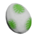
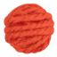
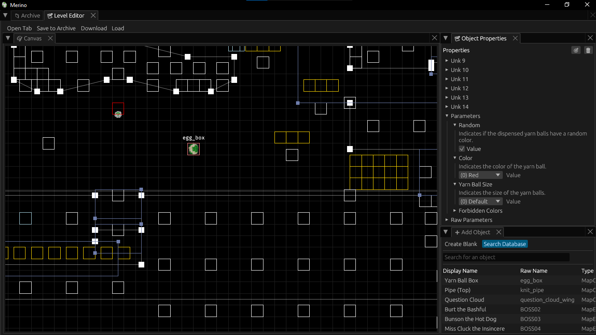
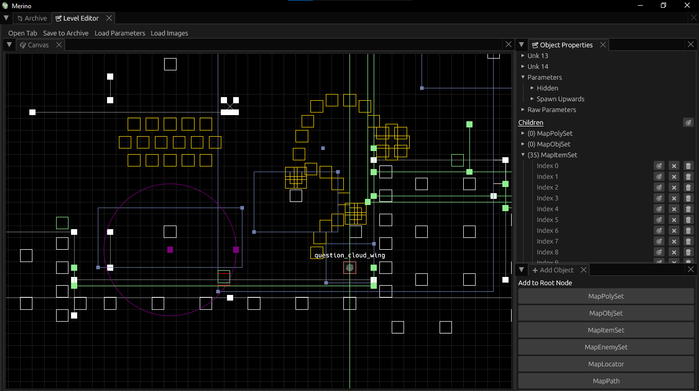
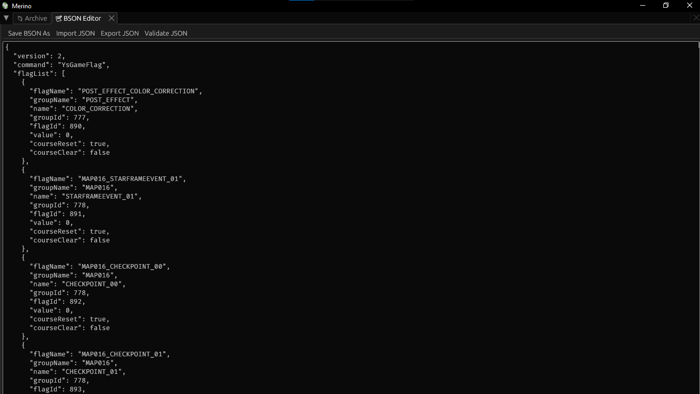

#  Merino
A *Yoshi's Woolly World* editor.

##  Features
- [x] Load files from archive
- [x] Level editor
- [x] BSON editor

### Roadmap
- [ ] 3DS support

##  Level Editor
### Features
- Edit `.mapbin` files
- Edit parameters with configurable data
- View images
- Download latest parameter/image data

### Screenshots

### Controls
Zoom:
- `Ctrl`/`Cmd` + scroll wheel (mouse)
- pinch (touchpad)

Camera pan: right-click

Drag/interact: left-click

Reset camera: right-click + `R`

Deselect: `Esc`

##  BSON Editor
### Features
- Edit `.bson` files as JSON
- Export/import JSON files

### Screenshots

## Info
Information on game objects is documented in [this respository](https://github.com/Swiftshine/yww-objectdb).

Images rendered for game objects can be found in [this repository](https://github.com/Swiftshine/yww-merino-image).

If you find that there is not sufficient information on any given game object, feel free to mess around with raw values and contribute to either of these repositories with your findings.
